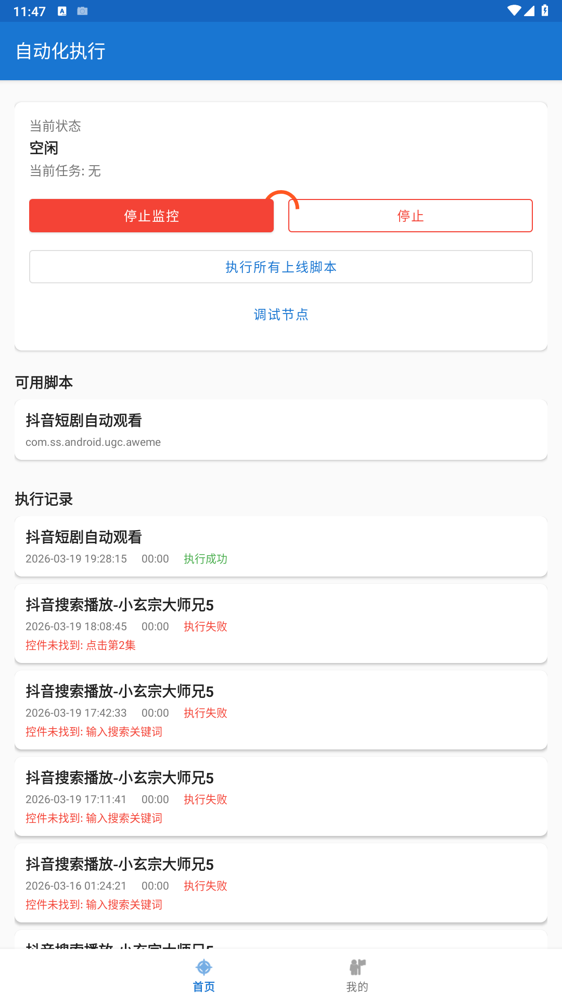
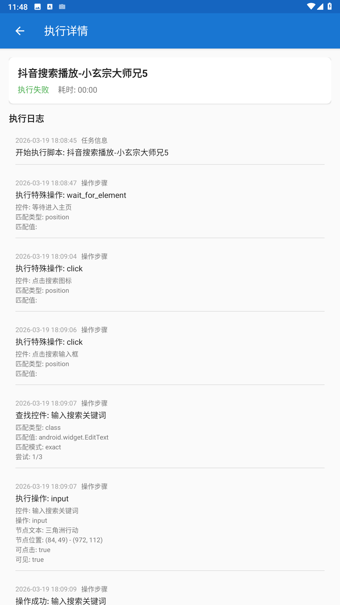
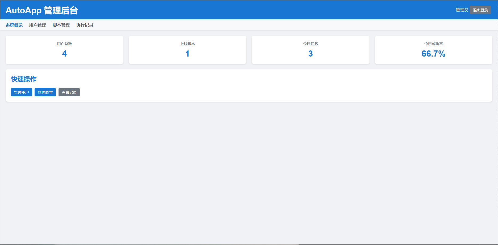
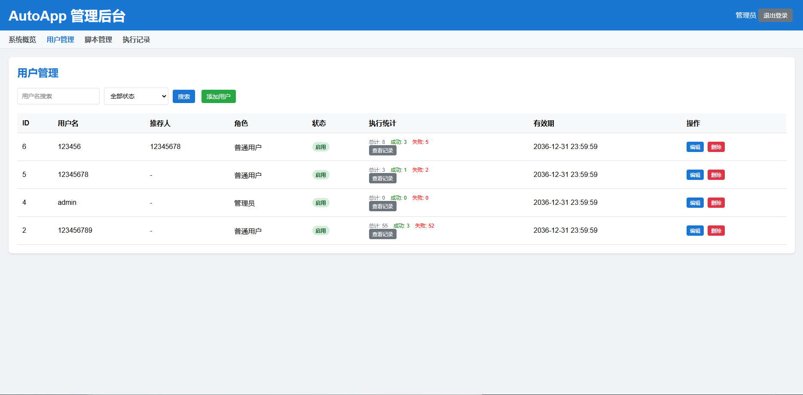
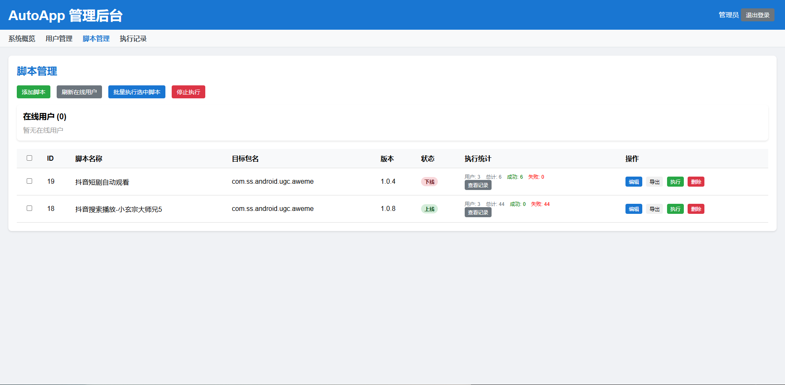

# AutoScript - Android 自动化脚本执行平台

<div align="center">


**一个功能强大的 Android 自动化脚本执行平台，支持 JSON 配置驱动，无需编写代码即可实现复杂自动化任务**

[功能特性](#功能特性) • [快速开始](#快速开始) • [文档](#文档) • [截图预览](#截图预览)

</div>

---

## 📖 项目简介

AutoScript 是一个基于 Android 无障碍服务的自动化脚本执行平台，采用 **JSON 配置驱动** 的设计理念，用户只需编写 JSON 配置文件即可实现复杂的自动化任务，无需编写任何代码。

### 核心特点

- 🔧 **零代码配置** - 通过 JSON 配置文件定义自动化流程，修改配置无需重新编译
- 📱 **跨应用支持** - 支持任意 Android 应用的自动化操作
- 🎯 **精准定位** - 支持文本、ID、描述、坐标、图标等多种元素定位方式
- 🔄 **智能容错** - 内置重试机制、备用策略、弹窗跳过等容错能力
- 🌐 **远程管理** - Web 后台管理用户、脚本、执行记录
- 📊 **实时监控** - 支持设备在线状态、执行日志、截屏查看

---

## ✨ 功能特性

### APP 端功能

| 功能模块 | 说明 |
|---------|------|
| **脚本执行引擎** | 基于 JSON 配置的通用执行引擎，支持点击、输入、滑动、长按等操作 |
| **无障碍服务** | 利用 Android AccessibilityService 实现跨应用操作 |
| **心跳服务** | 定时与服务器通信，保持在线状态 |
| **远程命令** | 支持服务器远程下发执行命令 |
| **日志上报** | 实时上报执行日志到服务器 |
| **截屏上传** | 支持设备截屏上传到服务器 |
| **悬浮窗调试** | 实时显示节点信息，方便脚本开发 |

### 后台管理功能

| 功能模块 | 说明 |
|---------|------|
| **用户管理** | 用户注册、登录、权限管理、到期时间设置 |
| **脚本管理** | JSON 脚本上传、编辑、状态管理 |
| **执行记录** | 查看任务执行历史、日志详情 |
| **在线监控** | 实时查看在线设备、发送执行命令 |
| **数据导出** | 执行记录导出为 CSV 文件 |

---

## 🚀 快速开始

### 环境要求

| 组件 | 版本要求 |
|------|---------|
| Android | >= 7.0 |
| PHP | >= 7.4 |
| MySQL | >= 5.7 |
| Nginx/Apache | 任意版本 |

### 安装步骤

#### 1. 后端部署

```bash
# 克隆项目
git clone https://github.com/zhaoxains/autoscript.git

# 进入后端目录
cd autoscript/AutoServer

# 安装依赖
composer install

# 导入数据库
mysql -u root -p auto_app < database/auto_app.sql

# 配置数据库连接
# 编辑 config/app.php
```

#### 2. APP 编译

```bash
# 进入 Android 项目目录
cd autoscript/AutoApp

# 编译 Debug APK
./gradlew assembleDebug

# 或编译 Release APK
./gradlew assembleRelease
```

#### 3. 配置 APP

在 APP 中设置服务器地址，登录账号后即可使用。

详细安装步骤请参考 [安装配置文档](INSTALL.md)。

---

## 📚 文档

| 文档 | 说明 |
|------|------|
| [安装配置文档](INSTALL.md) | 前后端详细安装配置指南 |
| [功能特性文档](FEATURES.md) | 完整功能说明与使用指南 |
| [脚本配置文档](SCRIPT_CONFIG.md) | JSON 脚本配置开发规范 |
| [API 接口文档](API.md) | 后端 API 接口说明 |

---

## 📸 截图预览

### APP 界面

| 主页 | 脚本列表 | 执行日志 |
|------|---------|---------|
|  |  |  |

### 后台管理

| 仪表盘 | 用户管理 | 脚本管理 |
|--------|---------|---------|
|  |  |  |

---

## 🏗️ 项目结构

```
autoscript/
├── AutoApp/                    # Android APP
│   ├── app/
│   │   ├── src/main/
│   │   │   ├── java/com/auto/app/
│   │   │   │   ├── engine/     # 执行引擎
│   │   │   │   ├── service/    # 后台服务
│   │   │   │   ├── ui/         # 界面
│   │   │   │   └── util/       # 工具类
│   │   │   └── res/            # 资源文件
│   │   └── build.gradle.kts
│   └── gradle/
│
├── AutoServer/                 # PHP 后端
│   ├── app/
│   │   ├── Controllers/        # 控制器
│   │   └── Core/               # 核心类
│   ├── config/                 # 配置文件
│   ├── database/               # 数据库结构
│   ├── public/                 # 公共目录
│   │   └── admin/              # 后台管理页面
│   └── scripts/                # 示例脚本
│
├── docs/                       # 文档目录
├── screenshots/                # 截图
├── README.md                   # 项目说明
├── INSTALL.md                  # 安装文档
├── FEATURES.md                 # 功能文档
└── SCRIPT_CONFIG.md            # 脚本配置文档
```

---

## 🔧 技术栈

### APP 端

- **Kotlin** - 主要开发语言
- **Jetpack Compose** - 现代 UI 框架
- **Hilt** - 依赖注入
- **Room** - 本地数据库
- **Retrofit** - 网络请求
- **Coroutines** - 异步处理
- **AccessibilityService** - 无障碍服务

### 后端

- **PHP 7.4+** - 后端语言
- **MySQL** - 数据库
- **JWT** - 身份认证
- **Composer** - 依赖管理

---

## 🤝 贡献指南

欢迎提交 Issue 和 Pull Request！

1. Fork 本仓库
2. 创建特性分支 (`git checkout -b feature/AmazingFeature`)
3. 提交更改 (`git commit -m 'Add some AmazingFeature'`)
4. 推送到分支 (`git push origin feature/AmazingFeature`)
5. 创建 Pull Request

详细贡献指南请参考 [CONTRIBUTING.md](CONTRIBUTING.md)。

---

## 📄 许可证

本项目采用 MIT 许可证 - 详见 [LICENSE](LICENSE) 文件。

---

## 🙏 致谢

- 感谢所有贡献者的付出
- 感谢开源社区的支持

---

## 📞 联系方式

- Issue: [GitHub Issues](https://github.com/zhaoxains/autoscript/issues)
- Discussion: [GitHub Discussions](https://github.com/zhaoxains/autoscript/discussions)

---

<div align="center">

**⭐ 如果这个项目对你有帮助，请给一个 Star ⭐**

</div>
